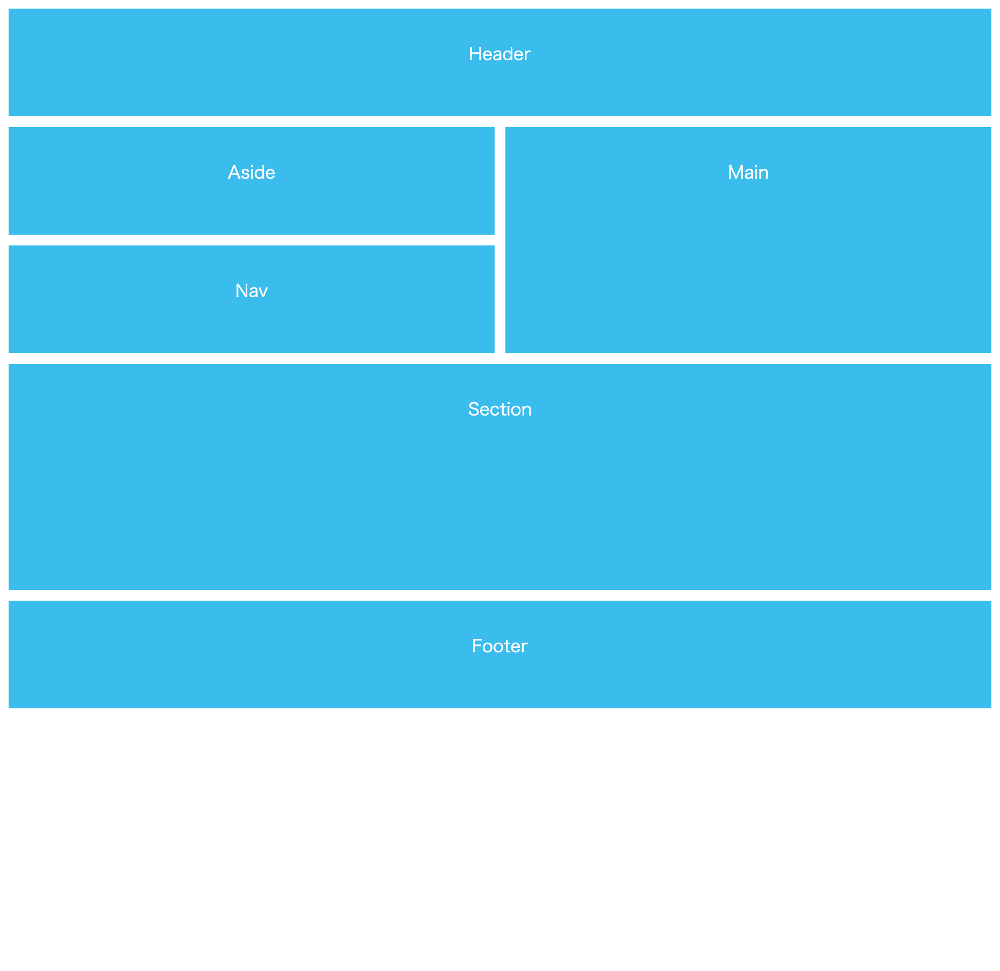
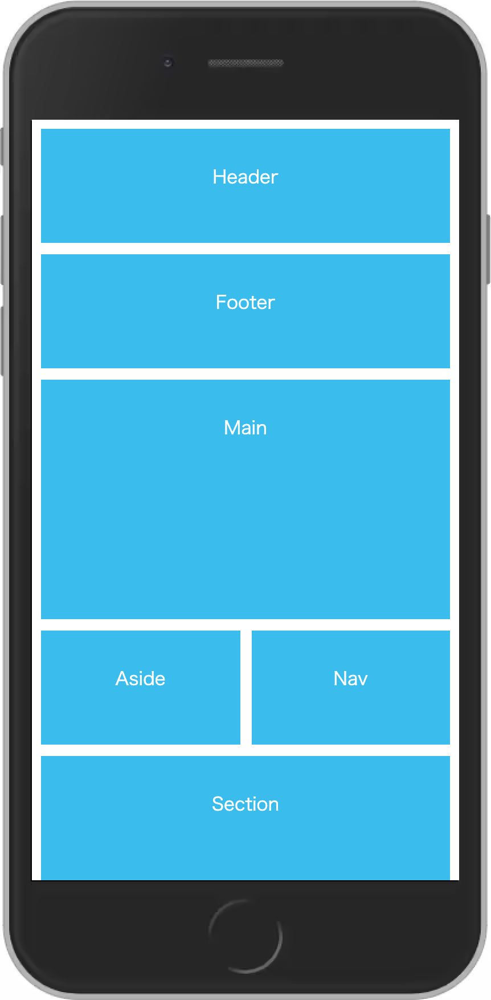

# CSS-Grid-Fundamental

##CreatedAt
2th Dec 2021

## ScreenShot of the project

For Desktop

For mobile

## Detail of the project

This is CSS Grid Fundamental Course in Youtube.
(Net Ninja's video is always awesome, by the way. 
 So if you don't know his channel, you should definitely check)

https://www.youtube.com/watch?v=x7tLPhnA06w

## Purpose of the project

Get the knowledge of CSS Grid Fundamentals

## Demo

https://hiros-dev.github.io/CSS-Grid-Fundamental/

## What did I learn from this project?

How to use CSS Grid

How to design Simple Web Layout

How to design Responsive Layout with CSS Grid

I already learned React and Sever side fundamentals(Node.js / Epress etc etc...)
But, CSS grid is not easy for me.
So, I think I should create some web pages with css grid in the future.
Of course, I will try!!!

Thank you for reading. And, happy coding!!!
